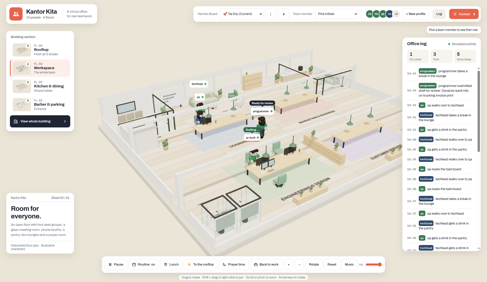

# Kantor Kita (Our Office)



**Kantor Kita** is an interactive, 3D office diorama that serves as a visual wrapper and task management UI for **Hermes Agent**. It visualizes your local AI agents as characters working in a virtual office, providing a fun and intuitive way to see what your AI workforce is doing behind the scenes.

Team members shown in the office are actual Hermes AI profiles on your system. AI agents will automatically process tasks assigned to them, while the office UI visualizes their activities in real time.

## Key Features

- **Interactive 3D Office:** A dynamic four-story office diorama where you can view your agents working, moving around, taking breaks, and interacting.
- **Visual Kanban Board:** Manage tasks and assign them to your Hermes AI profiles.
- **Hermes Profile Management:** Create, edit, manage seating arrangements, and delete Hermes profiles directly from the web UI.
- **Real-time Visualization:** Watch your agents react to tasks in real time. They will display status updates, speak in chat bubbles, and move around the office based on their work state.

## Getting Started

### Prerequisites
- Node.js 22+
- Hermes CLI installed on your system.

### 1. Hermes Setup
For now, all commands from this UI to Hermes are executed via the Hermes CLI and by directly reading the local `kanban.db` via SQLite. **That is why having the Hermes CLI working properly on your system is mandatory, and it does not require a Gateway Token.**

Initialize a Kanban board on your machine if you haven't already:
```sh
hermes kanban init
```

Create your board. Once created, open the Hermes Kanban dashboard and ensure the orchestration is set to **"auto"**.

To add AI agents, you can create them directly from the web UI using the **+ New profile** button, or via CLI:
```sh
hermes profile create frontend_dev
```

### 2. Configure Webhook (Recommended)
To allow the office UI to react in real-time when an agent uses a tool, claims a task, or blocks a task, add this webhook configuration to your `~/.hermes/config.yaml`:
```yaml
hooks:
  outbound:
    - name: kantor-ai-sync
      url: http://127.0.0.1:3000/api/webhook/hermes
      events:
        - kanban_task_claimed
        - kanban_task_completed
        - kanban_task_blocked
        - pre_tool_call
        - post_tool_call
```

### 3. Running the Application
Start the Node.js server to serve the visual office UI:
```sh
npm install
npm start
```
Open **http://127.0.0.1:3000** in your web browser.

### 4. Running the AI Worker
To let the AI agents start working on queued tasks autonomously (thanks to the "auto" orchestration you set earlier), open a new terminal and run the Hermes gateway:
```sh
hermes gateway start
```

*(The gateway will run in the background to process the tasks, while this visual office UI updates automatically as they work).*

## Task Lifecycle & Management
- Click **Tasks** at the top of the UI or select a character to assign tasks.
- The AI moves tasks through stages: **Queued → In progress → Review / Needs decision / Done**. 
- If the agent is blocked or needs a human decision, you can reply directly via the UI using the **Your answer** form, or bypass the questions entirely by clicking **Mark done** on the task card.

## Legacy Mode: Claude API (Not Recommended)
While this project was originally built for direct integration with the Anthropic API (Claude), **it has now fully migrated to Hermes**. 

You *can* still use the legacy local-only mode by selecting "Local Only (No Hermes)" in the board dropdown and providing an `ANTHROPIC_API_KEY` in the `.env` file. However, **this mode is not recommended** as active development and new features are focused entirely on the Hermes integration.

---

*(Note: The server does not have login authentication yet and only listens on 127.0.0.1 (localhost). Do not expose it to public networks.)*